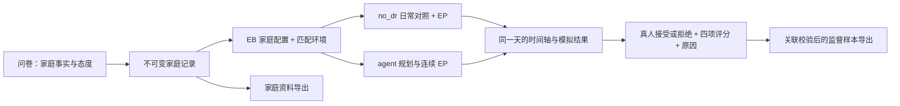

# EnergyBridge 真人家庭数据采集

收集真人家庭资料，通过原 EB 的 `no_dr` 与 `agent` 日内运行生成两份 EP 模拟结果，再由家庭代表给出接受／拒绝、四项评分及原因。

**本项目负责数据采集、保存、校验和交付。SFT 训练、独立评测、训练模型接回 EB 由下游项目负责，不是本网站的上线条件。**



- 一人代表全家填写成员资料和最终评价；不生成虚构成员投票，不强制归入五类家庭。
- 开始填写前分配全年随机日期，刷新后保持一致。城市匹配气象站；房型、面积、楼层匹配等效研究住宅。模型与典型年天气不是用户家的实测数据。
- 中间保留固定上游版本的原生规划、技术检查和回退；去掉模拟家庭接受检查及最终模拟评分。补齐所选设备的 EP 执行接口。
- 保留不变、回退、负收益及拒绝样本。失败任务保留问卷和错误状态，不伪造完整方案或真人标签。
- 四项评分沿用 EB 字段 `score / comfort_score / energy_score / vpp_score`，允许 1—5 小数。
- VPP 响应从 17:00、18:00、19:00 中抽取开始时刻，持续时间从 1 小时、2 小时中抽取；抽样在展示方案前完成，不依据用户反馈重抽。
- 同意／不同意、四项评分和简短原因都是当前真人反馈协议的必填项；原因原文进入监督样本，不由系统补写。
- 电价沿用原 EB 天津归一化分时价格，作为所有参与者一致的研究条件；不是当地真实电价，不展示为人民币节省金额。后续可以按版本替换电价资源，不改写已收集情境。

## 复现

Python 3.10+（CI 用 3.11）、EnergyPlus **24.1**。上游固定为作者仓库提交 `2b17ae63e613da776c93e900f5dace50d63a88a8`。

```bash
python3 -m venv .venv
.venv/bin/python -m pip install -r requirements.txt
.venv/bin/python scripts/bootstrap_upstream.py
.venv/bin/python scripts/bootstrap_resources.py
EPLUS_ROOT=/path/to/EnergyPlus-24-1-0 EB_TEST_NATIVE_EP=1 .venv/bin/python scripts/test_offline.py
```

资源脚本下载固定来源的天气、生成住宅并校验 SHA-256，不调用模型。仓库只保存资源目录、构建脚本及验证记录，不直接再分发第三方天气／IDF 原文件。已下载的资源可以用 `--source-cache /path/to/existing-checkout` 重用。资源恢复失败时停止，不换用其他天气。

本地只看页面及保存测试问卷：

```bash
.venv/bin/python realtime_pilot/server.py --port 8766 --disable-planning --data-dir /tmp/eb-survey-demo
```

浏览器访问 `http://127.0.0.1:8766/`。默认工程模式，不能作为真人标签；正式采集使用独立数据目录及 `--human-pilot`。管理员试答始终标记为工程数据。

## 运行与交付

- [数据保存与导出](docs/DATA.md)
- [当前问卷数据字典](QUESTIONNAIRE_CODEBOOK.json)（由运行代码生成）；`QUESTIONNAIRE_CODEBOOK_LEGACY.json` 仅供历史入口读取。
- [本轮修复与验收](docs/DATA_COLLECTION_RELEASE_20260912.md)
- [最终上线前审计](docs/PRELAUNCH_AUDIT_20260912.md)
- [部署步骤](docs/DEPLOYMENT.md) / [配置模板](deploy/service.env.example)
- [计算服务器接入](deploy/SCHOOL-COMPUTE.md) / [并发设置记录](deploy/CONCURRENCY-20260912.md)
- [地区与全年日期](simulation_resources/README.md)
- [第三方来源说明](THIRD_PARTY.md)

演示入口：**https://47.85.194.154/**（需要受邀登录）。这是部署地址，不包含账号或密码，地址可能随部署调整。

目前采用阿里云入口、学校 CPU 仿真和 Mac 反向隧道；Mac 持续运行是已接受的部署前提。并发由任务队列、EP 槽和 API 槽分别限制；50 人填写不等于同时执行 50 个仿真。容量和超时按实测设置，不能承诺任何人数都没有排队。

SQLite 是权威存储；家庭问卷先保存，计算或反馈失败不会撤销已保存问卷。重复提交幂等，参与者次数与队列有限额，管理员仍受资源及超时保护。可用 `scripts/scheduled_backup.py` 做一致性快照；原始 EP 轨迹需另外备份。

公开仓库不包含真人问卷、数据库、日志、密钥或服务登录凭据。历史审计文档保留当时结论，现状以本 README 和本轮修复记录为准。仓库公开可读不等于授予第三方资源或上游代码的再分发许可。
