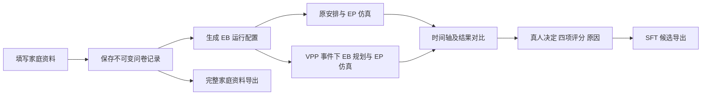

# EnergyBridge 真人家庭问卷

通过问卷保存真人家庭资料，将其中的运行信息接入 EnergyBridge（EB）和 EnergyPlus（EP），展示原安排与调整方案，再收集家庭的接受／拒绝、四项评分和原因，构造家庭角色模拟器的 SFT 候选数据。

**当前交付是可部署的研究原型，不代表已经生产上线。** 域名、HTTPS、真实模型配置及真实模型参与的端到端延迟仍需部署方完成验证。默认关闭方案生成；家庭资料可以独立保存。

## 主要流程



- 成员信息由一位填答者根据了解代填，不当作成员独立投票。
- 家庭成员、设备、日常习惯与态度原样留存；研究扩展资料不自动改变天气、建筑或设备数量。
- 当前 EP 使用统一研究住宅与天津典型夏季天气，不是对每个真实住宅的重建。
- 不使用模拟评分器代替真人标签；不强制归入原 EB 五类家庭。
- 尚未生成方案或未评价的家庭资料，也可独立导出。

## 仓库与上游

```text
realtime_pilot/                 问卷、服务、EB/EP 接入及测试
QUESTIONNAIRE_CODEBOOK.json     基础问卷定义
scripts/                       上游获取、离线测试和发布检查
upstream_2b17ae6/               单独获取的固定 EB 源码，不提交 Git
deploy/                       systemd、Nginx 与环境变量模板
docs/                         部署及数据说明
```

上游固定为 `2b17ae63e613da776c93e900f5dace50d63a88a8`，通过 `python scripts/bootstrap_upstream.py` 获取并验证。本仓库不内嵌上游源码；上游授权情况需单独核实，本仓库没有声明开源许可证。

## 本地验证

使用 Python 3.10+；持续集成使用 Python 3.11。Ubuntu 部署基线为 22.04、EnergyPlus 24.1。

```bash
python3 -m venv .venv
.venv/bin/python -m pip install -r requirements.txt
.venv/bin/python scripts/bootstrap_upstream.py
EPLUS_ROOT=/你的/EnergyPlus-24.1目录 EB_TEST_NATIVE_EP=1 .venv/bin/python scripts/test_offline.py
```

离线测试脚本阻止外部网络连接，使用工程答案及模型桩。部分真实 EP 测试需先安装 EP 24.1；跳过它们不能作为 EP 验收通过。

仅查看问卷、验证保存流程：

```bash
.venv/bin/python realtime_pilot/server.py --port 8766 --disable-planning --data-dir /tmp/energybridge-survey-test
```

此命令为工程模式，保存的答案不标记为真人训练标签。更换新测试目录可隔离历史数据。浏览器打开 `http://127.0.0.1:8766/`。

## 部署与数据

- [Ubuntu 部署步骤](docs/DEPLOYMENT.md)
- [资料保存、标签与导出](docs/DATA.md)
- [部署配置](deploy/service.env.example)

50 人同时填写与保存，不等于 50 个 EP 仿真同时运行。2 vCPU / 4 GB 可先设置 2 个任务工作线程、1 个 EP 计算槽，按实测再决定是否升至 2 个 EP 槽；真实模型等待时间、排队时间、内存和磁盘都需要观察。
