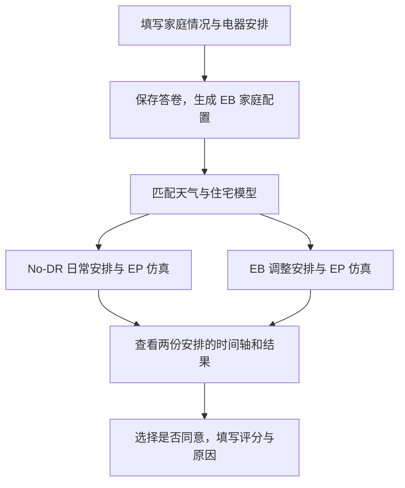

# EnergyBridge 家庭用电问卷

网站：https://47.85.194.154/

数据样例：[完整案例](examples/real-test-20260914/full-collected-record.json) · [清洗后的 input / output](examples/real-test-20260914/cleaned-supervision.json)

这个项目用问卷收集家庭对用电调整方案的评价。参与者先填写家庭情况，系统调用 EnergyBridge（EB）规划和 EnergyPlus（EP）仿真，展示日常安排与调整后的安排，再收集同意或不同意、四项评分和原因。数据用于后续训练家庭评价模型。

本仓库包含问卷网站、任务队列、仿真接入和数据导出代码。模型训练由后续项目负责。

## 填写流程



一位参与者代表家庭填写成员资料及最终评价。系统直接使用填写的家庭信息，不把家庭归入原 EB 的五类预设。问卷内容包括成员情况、用电习惯、电器时间安排、能源态度和住房信息；补充字段供后续分析使用。

洗衣机、洗碗机和烘干机先填写最早开始、最晚完成和运行时长，再选择平时开始时间。滑块每 10 分钟一档，可选范围随前三项变化；温度支持 0.1℃。

规划使用固定版本的原 EB `no_dr` 和 `agent` 入口，保留技术检查与回退，移除模拟家庭的接受判断和最终评分，并接入所选电器的 EP 执行接口。具体改动见[上游接口核对记录](docs/upstream-binding-review/README.md)。

## 查看数据

| 文件 | 内容 |
|---|---|
| [questionnaire-answers.json](examples/real-test-20260914/questionnaire-answers.json) | 用户实际提交的答案及提交版本 |
| [full-collected-record.json](examples/real-test-20260914/full-collected-record.json) | 答卷、家庭配置、情境、两份方案、展示结果及反馈 |
| [cleaned-supervision.json](examples/real-test-20260914/cleaned-supervision.json) | 家庭画像、事件、计划和可见结果作为输入；真人评价作为输出 |

以上样例来自项目维护者授权公开的一次真实试填，当时按工程测试记录保存。其他答卷、数据库、运行日志和凭据不提交到仓库。服务器保存格式与导出命令见[数据说明](docs/DATA.md)。

## 本地运行

需要 Python 3.10+；运行仿真还需要 EnergyPlus 24.1。

```bash
git clone https://github.com/Fanmili-5/energybridge-household-survey.git
cd energybridge-household-survey
python3 -m venv .venv
.venv/bin/python -m pip install -r requirements.txt
.venv/bin/python scripts/bootstrap_upstream.py
.venv/bin/python scripts/bootstrap_resources.py
.venv/bin/python realtime_pilot/server.py --port 8766 --disable-planning --data-dir /tmp/eb-survey-demo
```

打开 `http://127.0.0.1:8766/`，可以填写并保存测试问卷。此命令不调用模型。资源脚本会下载固定版本的天气和上游文件，并检查哈希；已有资源可通过 `bootstrap_resources.py --source-cache /path/to/existing-checkout` 复用。

离线后端测试：

```bash
.venv/bin/python scripts/test_offline.py
```

安装 EnergyPlus 后，可加入原生仿真测试：

```bash
EPLUS_ROOT=/path/to/EnergyPlus-24-1-0 EB_TEST_NATIVE_EP=1 .venv/bin/python scripts/test_offline.py
```

测试脚本禁止访问外部网络，使用固定模型回复。启用真实规划需要单独配置模型服务，见[部署说明](docs/DEPLOYMENT.md)。

## 文档

- [问卷字段与用途](docs/QUESTIONNAIRE.md)
- [数据保存与导出](docs/DATA.md)
- [天气、住宅和日期匹配](simulation_resources/README.md)
- [中文答案转为英文 EB 输入](docs/planner-language.md)
- [部署与维护](docs/DEPLOYMENT.md)
- [文档目录与历史记录](docs/README.md)
- [第三方代码及资源来源](THIRD_PARTY.md)

当前公开站用于工程试填，正式分发前仍需完成全量回归与容量验收。待处理问题见[验证记录](docs/AUDIT.md)。
