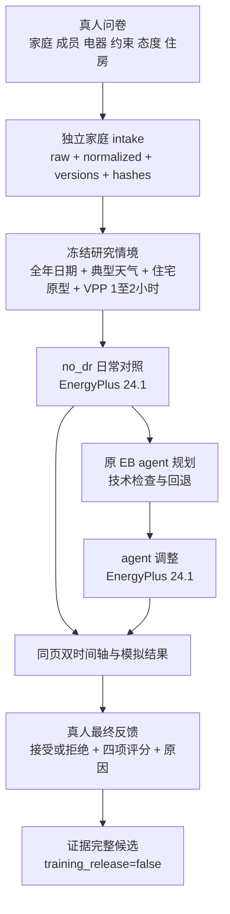

# 系统检查记录 · 2026-09-14

> 历史记录，保留当时的测试结果和设计依据。项目使用说明见[文档目录](README.md)。

## 结论

当前版本已满足**受控工程演示与小规模试填**：问卷、家庭记录、原 EB `no_dr/agent` 主线、两次 EnergyPlus 24.1、双时间轴、真人反馈、SQLite 保存和候选导出均连通。本轮没有发现正在发生的数据损坏或 P0 代码阻断。

它还不应直接被描述为“全国大规模正式采集已就绪”。正式分发前仍需切换隔离的真人数据目录和 `human_pilot` 模式，完成四季代表组合验证、少量授权真实模型测量、异机备份与监控。当前公网地址继续作为工程演示，现有工程记录不得改标真人数据。

## 审计维度与判断

| 维度 | 判断 | 关键证据或边界 |
|---|---|---|
| 研究目标 | 通过 | 唯一监督来自家庭代表的 accept/reject、四项小数评分和原因；训练与独立评测属于下游。 |
| 问卷到 EB | 通过 | 真人字段构成每户独立 JSON，不强制套入五类家庭；成员信息是家庭代表代述，不生成虚构成员投票。 |
| EB 主线 | 通过 | 当前入口为 `paired_worker → native_worker → native_runner → run_family_agent`；保留原生规划、技术检查和回退，移除模拟家庭接受及最终模拟评分。 |
| EP 配对与物理证据 | 条件通过 | 同家庭、日期、建筑、天气、价格和 24 小时时域运行 `no_dr` 与 `agent`；并非事件前状态完全相同的严格因果反事实。两份 `eplusout.sql` 已加入强制哈希。 |
| 数据与 SFT | 通过 | 原始回答、规范化回答、题表/情境/方案/展示/反馈及哈希分层保存；清洗输入只含家庭画像、事件、No-DR 与 EB 计划，真人选择、评分和原因只在输出；所有样本仍为 `training_release=false`。 |
| 前端可用性 | 通过 | 390px/1365px、工程/真人模式、六页问卷、地区联动、滑块、刷新恢复、时间轴、小数评分均通过；axe WCAG 2A/AA 为 0。 |
| 并发与恢复 | 条件通过 | 50 人保存和排队已有工程证据；真实模型 50 人完成时间尚未测量。远程任务 ID 已改为跨数据目录稳定，超时顺序已加入启动校验。 |
| 安全与运维 | 条件通过 | TLS、Basic Auth、Nginx、SQLite、计算隧道均健康；正式扩散前仍需轮换曾暴露的模型密钥、异机备份、磁盘/隧道/API 预算告警和 SSH 收口。 |
| 线上一致性 | 条件通过 | 当前线上是有意保留的 engineering 模式；正式模式必须使用新目录，不能在现有库上直接改标签。 |

## 本轮已修正

1. 远程计算幂等 ID 由逻辑案例 ID、请求哈希和发布哈希构成，不再把数据目录绝对路径当作身份；灾备换目录不会因此重复创建同一计算。
2. 远程部署模板采用计算节点 1200 秒、代理 1320 秒、网站 worker 1440 秒；`start.sh` 会拒绝外层超时不大于内层的配置。
3. `baseline/eplusout.sql` 与 `proposal/eplusout.sql` 进入 outcome 证据哈希及真人候选必需证据集合。
4. 采集漏斗区分 `candidate_saved`、`candidate_evidence_verified`、`current_version_eligible` 和 `human_export_eligible`；同时区分提交时冻结的环境就绪状态与当前目录重算状态。
5. 最后一页提供“跳过选填，前往提交确认”；反馈原因明确标为必填；新参与者没有历史记录时隐藏历史面板；手机时间轴标签增大。
6. 完整工程样例重生为 v4.3 问卷、v3.4 配对协议、66 个字段、两次实际 EnergyPlus 24.1、零模型 API 调用，并明确标记为工程数据。

## 当前真实数据流

基线失败时保存家庭问卷并停止，不调用规划模型、不重抽日期、不伪造标签。规划技术回退若能完成第二次 EP，仍原样展示给真人评价；不会按节电量、回退状态或预期接受率筛选样本。

## 模拟会得到什么

每个完成案例会保存：

- 冻结环境：日期与季节、天气站和 EPW/DDY 哈希、住宅原型与 IDF 哈希、面积/楼层匹配、统一天津归一化分时价格、VPP 开始和结束时刻。
- 两条策略：原日常安排、`no_dr` 执行摘要、EB proposal、全天决策与真实 actuator 写入、技术回退状态、模型请求/回复证据。
- 两次 EP：全天及 VPP 时段电量/平均功率/费用指标/室温，全天每 10 分钟电量和室温序列，设备时间轴、任务截至 24:00 的完成状态、`eplusout.err`、`eplusout.sql` 及哈希。
- 真人监督：`decision`、`score`、`comfort_score`、`energy_score`、`vpp_score`、`comment`。四项评分允许 1—5 小数；旧 EB 字段名保留，页面含义分别是整体、舒适、用电与费用、响应安排与自主控制。
- 当前清洗数据：`input` 仅含家庭画像、事件条件、No-DR 计划和 EB Agent 计划；`output` 是该家庭的真人选择、四项评分与原因。不生成 system prompt 或 messages；EP 指标留在完整采集记录。

这些是研究原型模拟，不是用户真实电表、当地实时天气或节省承诺。全国日期可以抽样，但当前大规模资源预验证仍集中在夏季；每个个案会在规划前真实跑基线，失败不会进入完整候选。

## 验证结果

- 完整离线回归：186/186 通过，包含 EnergyPlus 24.1、全年日期、六类设备、远程计算、SQLite、幂等和导出契约。
- 浏览器回归：390px 和 1365px，工程模式与隔离真人模式均通过；axe WCAG 2A/AA 无违规。
- 当前工程样例：实际保存 intake，实际运行两次 EnergyPlus，固定离线规划桩，模型调用 0，`training_release=false`。
- 线上只读检查：TLS、Basic Auth、Nginx、应用、SQLite 和计算隧道健康；公网只开放 22/80/443。线上配置仍为 engineering。

## 正式分发门禁

以下事项完成前，结论保持“受控试填”，不能升级为“正式大规模采集”：

1. 建立全新的真人数据目录，以 `--human-pilot` 启动并读回 `collection_mode=human_pilot`；保留现有工程库。
2. 用少量已授权真实模型案例测量每任务调用数、P50/P95 延迟、技术回退率和费用；工程替身压测不能回答这些问题。
3. 对省级代表站和主要房型至少完成冬、春、夏、秋各一日冒烟验证，并按季节、地区、房型报告基线失败率，控制样本选择偏差。
4. 配置异机加密备份、恢复演练、磁盘 70%/80%、隧道、证书、队列失败和 API 预算告警。
5. 正式扩散前轮换曾在会话中暴露的模型密钥；限制 SSH 来源或使用非 root 运维账号。
6. 先让少量非开发者完成手机试填，记录完成时间、最后一页流失和题意误解，再决定是否继续缩短成员及选填问题。

并发判断仍为：50 人同时保存和进入队列可承受；真实方案生成受模型 API 槽限制，不能承诺 50 人同步完成。失败时优先保留问卷和可恢复任务状态，不自动重复调用付费模型。
