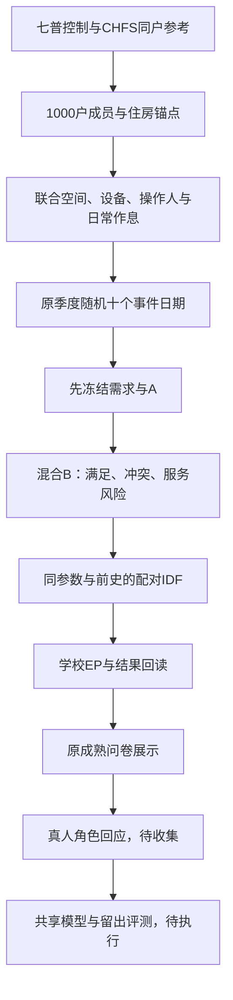

# 全流程与当前有效入口

源码根目录为 `docs/research/collection-adjustment-20260930/household1000/`。源快照保留依赖的阶段布局；下表/`PIPELINE.json`选择当前链，其他历史诊断代码不能覆盖V17状态。

| 环节 | 主要源码路径（相对源码根） | 输入/输出与有效范围 |
|---|---|---|
| 人口框与联合家庭 | `production_route_v6_20261004/code/build_census_frame.py`、`generate_joint_population.py`、`joint_motifs.py` | 七普控制、同户CHFS粗化模式→1000户/2524人；未观察完整联合仍是模型 |
| 住房联合几何 | `idf_joint_production_20261005/code/joint_housing.py`、`reference_world.py` | H6建筑面积、H7自然间、成员与功能空间共同构造 |
| 设施/边界/服务 | `production_evidence_completion_20261006/code/`、`joint_housing_service_worlds_20261006/code/` | 来源设施、共享权利、床位、门口、围护与设备端口 |
| 背景与热边界 | `complete_reference_worlds_20261006_v12/code/` | 明确背景/人员/供热参考范围，不等于真实整户账单 |
| 任务与日期 | `random10_task_worlds_20261007/code/assemble_random10.py`及V16 `code/plans.py` | 成员、设备、服务、程序和原季度随机十天；不按结果重抽 |
| 当前共同设备世界 | `joint_static_production_20261007_v16/code/build_worlds.py`、`joint_geometry.py` | 4–6功能类、具体资产、安装/回路/操作时钟；来源值与设计配置分层 |
| 当前A/B | `roleplay_mixed_static1000_20261007_v17/code/generate.py`、`assess.py` | 输入前冻结A；B允许可表达的服务冲突；静态破坏仍拒绝 |
| 角色投影 | V17 `code/project_actors.py` | 同世界关系、设备、日程→角色资料；没有真人标签 |
| 配对IDF | V17 `code/compile.py`→V16 `code/compile_inputs.py` | 同世界与参数、共同七日前史→20000份输入；编译不等于执行 |
| 学校50户执行 | `roleplay_mixed_production_20261007_v17/code/run_ep.py`、`calendar_bridge.py`、`readback.py` | 仅原50户500对；日期、能量、热水与SOC分别核查 |
| 原问卷构建 | 同阶段`code/build_site.py`、`prepare_frontend.py`、`bind_frontend.js`、`serve50.py` | 回读后果→原成熟前端；模板内案例已移除，生成时从准备好的私有包填入 |
| 反馈与研究导出 | 同阶段`frontend_snapshot/unified_live_server.py`、`source-draft.js`、`joint-view.js` | 当前工程试填；正式演员身份/历史/切分合同待落实，不自动生成真人集 |

程序、频次和精确时钟都要保留来源/设计身份。日期随机不使B条件成为随机因果实验；当前可支持完整条件下的回应预测，不能用两组平均采用率直接估计“可行性”的因果效应。

公开的完整代码路径、前置输入和完成状态由`PIPELINE.json`登记。历史脚本有固定路径及阶段缓存要求；公开同步保留科学源码，不在发布时改写家庭、方案或仿真结果。
