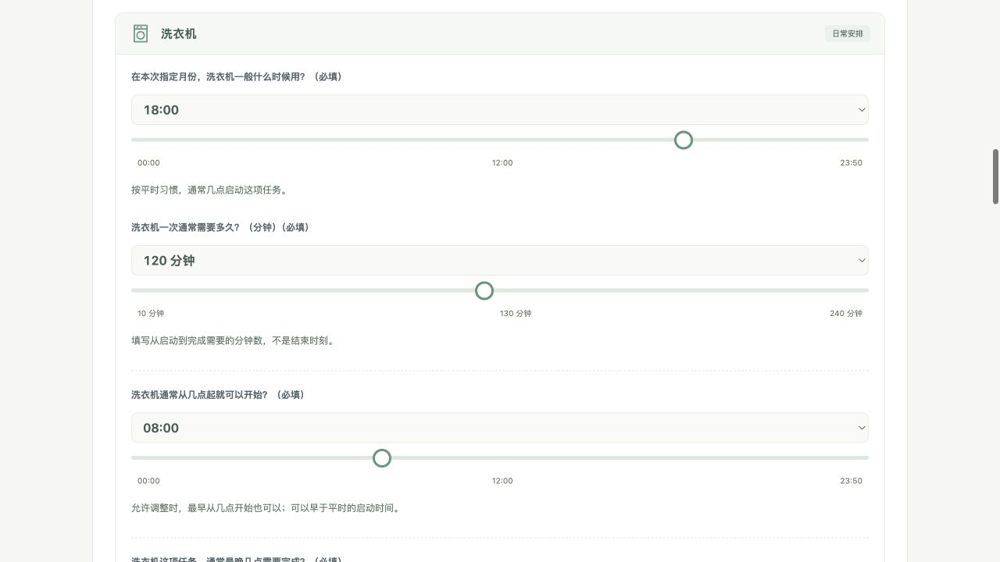
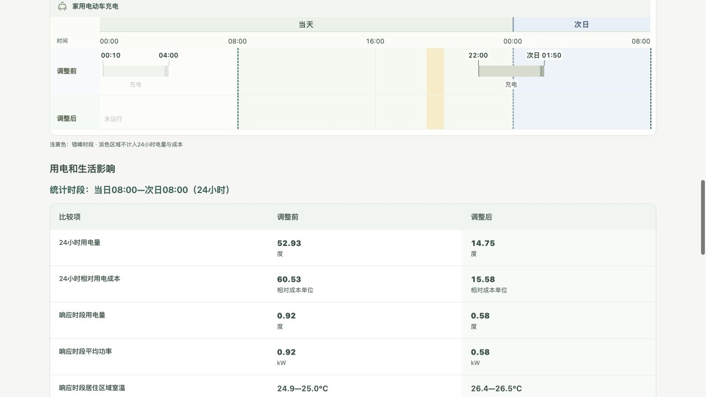

[打开问卷](https://47.85.194.154/)

**填写家庭信息 → 匹配模拟环境 → EP生成原安排结果、EB规划后再由EP执行 → 真人比较并评价 → 保存JSON与SFT样本。**

## 1. 问卷收集什么
由一人代表家庭填写，成员态度也由此人代填；最后只给一份家庭评价，不模拟成员投票，也不强行归入原EB的五类家庭。

- **家庭日常：** 人数、在家时段、作息规律，形成EB家庭背景和EP人员日程。
- **家庭成员：** 年龄段、生活状态、作息与能源态度，供EB理解成员需求。
- **电器安排：** 拥有哪些电器、原使用时间、最早开始和最晚完成时间，以及温度、充电等要求，构成原安排和可调整范围。
- **住房信息：** 省市、住宅类型、面积与楼层，用于匹配天气和建筑模型。
- **补充资料：** 收入、账单等可选信息保留供后续分析；不作为EB或EP必需输入。

时间以10分钟为一档，温度可选到0.1℃。题目只随已选设备展开。[完整问题与选项逐行查看](https://github.com/Fanmili-5/energybridge-household-survey/blob/main/docs/notion-review/readable-20260914/field-introduction.md)

## 2. 日期、天气、建筑如何进入EB与EP
**先定日期，再按回答匹配环境，最后运行两份安排。**

1. **日期怎么抽：** 打开问卷时，从全年365天等概率抽一天，每天概率1/365；同一浏览器会话固定，刷新不重抽。用户按该月份填写习惯。2007只是非闰年日历坐标，天气来自典型年文件，不是2007年的真实天气。
2. **天气有哪些、怎么选：** 当前246份已验证站点资源，覆盖34个省级地区：214份CSWD、25份TMYx.2011–2025、7份其他TMYx，来自OneBuilding。先在所填省份找同城站；若没有，就用该省预设代表站，**不按距离选最近站**。例如广东未匹配到同城站时用广州。随后读取该站EPW中抽中日期及跨日延续的天气。目录另有92条不可用记录，不参与匹配。[完整站点目录](https://github.com/Fanmili-5/energybridge-household-survey/blob/main/simulation_resources/catalog.json)
3. **建筑怎么选：** 从50个已验证原型中，按住宅类型、楼层、面积区间和面积口径匹配。五档面积对应40、70、105、140、180㎡；填建筑面积时乘0.8得到室内面积。原型沿用作者的材料与设备研究参数，再替换站点位置、设计日和地温；不是复原用户真实房屋。
4. **事件怎么抽：** VPP从17:00、18:00、19:00等概率选开始时刻，时长从1、2小时等概率选取；不按用户评分筛选。电价暂统一沿用EB天津归一化分时权重，输出相对成本，不是人民币。
5. **两份结果怎么来：** 问卷先转换为EB家庭JSON和设备原日程。原生日程经EP得到调整前结果；EB读取家庭需求、VPP与模拟状态生成并更新计划，EP执行得到调整后结果。两路共用日期、天气、建筑和事件；保留原生技术检查与回退，家庭接受与最终评价由真人完成。

**仿真长度与统计长度分开：** EP按10分钟步长，从当天00:00运行，按完整日覆盖统计终点及所填任务期限，因此实际跑1或2天。比较表固定统计24小时：有EV从离家时刻算到次日同刻；无EV从00:00算到次日00:00。例如离家08:00，EP跑两天，比较表只累计当天08:00—次日08:00。其他设备仍可能跨出这24小时，不能保证所有任务都计入同一窗口。

资源匹配失败或EP失败时保留问卷，不生成虚构结果。全年日期已开放，但模型供暖仍固定20℃，空调调整主要对应制冷。

## 3. 用户如何比较、如何回答
验证码通过后进入等待页，完成后展示**同一电器上下两条时间轴**及用电、成本、室温和任务完成情况；跨日标“次日”。用户选择同意或不同意，再填整体、舒适、用电费用、调整与自主体验四项小数评分及原因。

SFT将家庭信息和方案比较作为输入，将真人选择、四项评分和原文原因作为输出。下方JSON包含原始提交、实际EB配置、EP结果、反馈和导出消息；样例来自工程测试，尚非真人训练数据。当前仍需修正候选输入中未显示的备注，并补记评分时页面版本，详见[审查记录](https://github.com/Fanmili-5/energybridge-household-survey/blob/main/docs/notion-review/current-20260914/AUDIT.md)。

## 4. 完整原始JSON
[完整原始记录 JSON](../current-20260914/full-collected-record.json)

[实际导出的 SFT messages JSON](../current-20260914/sft-messages.json)

<!-- Documentation verified against date_sampling.py, simulation_environment.py, paired_contract.py, native_scenario.py and catalog.json on 2026-09-14. Notion content and embed read back; authenticated Notion visual rendering not checked. -->
