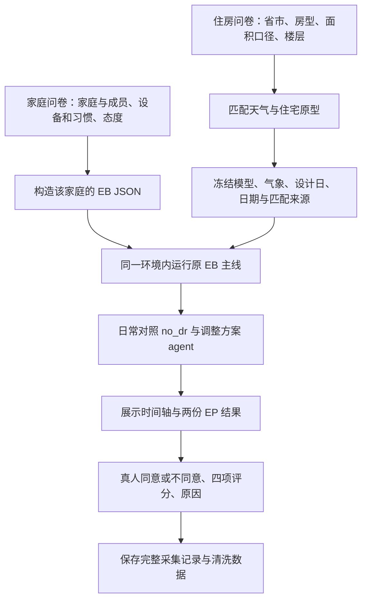

# 问卷 → 地区环境 → 原 EB → 真人反馈

**住房信息参与物理环境选择，家庭事实与态度进入 EB 输入；不归入五类预设家庭。** EB 连续规划、设备调度与控制逻辑保持原流程。最终评价由真人提供。

| 输入 | 使用位置 |
|---|---|
| 省级地区、城市 | 优先同城天气；缺少可用同城组合时使用省内代表站，并向用户说明 |
| 公寓 / 独立 / 联排、面积区间、面积口径 | 选择具有相应面积和外界接触边界的 IDF 研究原型 |
| 公寓底层 / 中间层 / 顶层 | 区分地面、屋顶及相邻楼板的热边界 |
| 建筑年代、产权、收入等补充资料 | 保存供后续研究；当前不据此改造墙体或推断家庭态度 |
| 设备、时间窗口、成员与家庭态度 | 继续走已有问卷 → EB 家庭配置、记忆与规划上下文接口 |

每个案例新增 `simulation_environment.json`，记录：原填省市与住房答案、实际气象站、同城或省代表站匹配方式、原型 ID、面积假设、EPW/DDY/IDF 与资源目录哈希、冻结日期、随机种子、未校准声明。根目录和两个仿真分支都保存同一环境记录，分支比较核对哈希。

原始回答仍保存在 `household_record.json`；`household_config.json` 保存 EB 的实际输入；原生运行、设备控制、物理结果和页面内容继续按现有流程保存。当前清洗输入只含家庭画像、事件条件、No-DR 计划和 EB Agent 计划；EP 指标与服务结果留在完整采集记录。输出只使用真人的 `accept/reject`、`score`、`comfort_score`、`energy_score`、`vpp_score` 和原因；允许小数，不根据规则补分。

技术失败与方案评价分开：EP 严重错误、缺失设备接口或结果不完整时不生成评分样本。技术运行有效但用户不满意的方案继续保留。匹配失败也不删除家庭原答案。

当前仍采用原 EB 天津分时价格**权重**作为统一实验条件，费用为相对成本；没有伪装成每个城市的人民币居民电价。新增的建筑是研究近似，不是已校准的全国住宅库。
